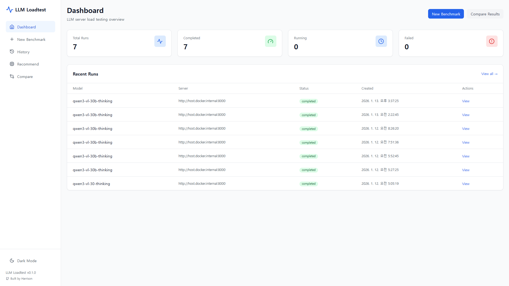
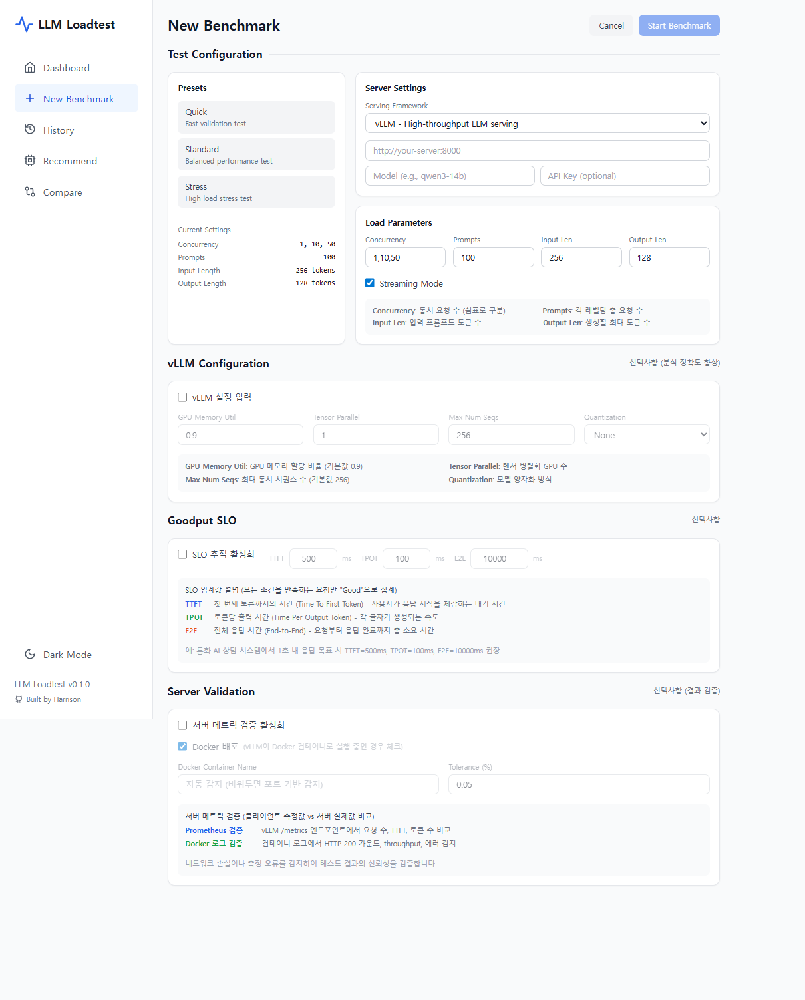
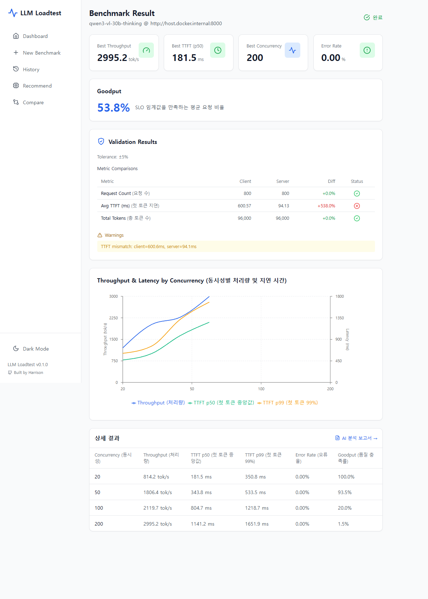
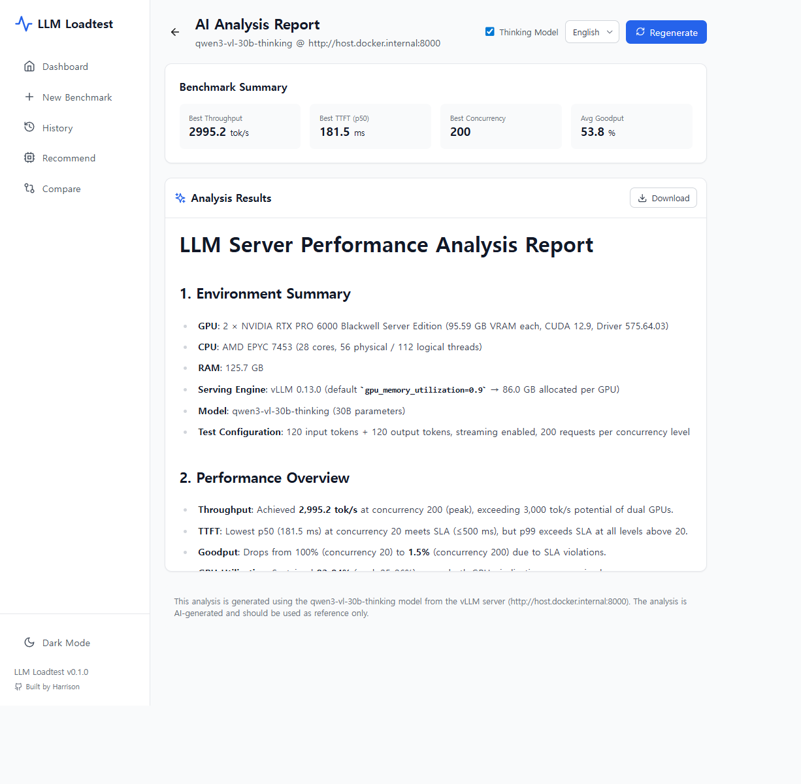

# Simple LLM Tester

[](https://opensource.org/licenses/MIT)
[](https://www.python.org/downloads/)
[](https://fastapi.tiangolo.com/)
[](https://nextjs.org/)
[](https://www.docker.com/)

<p align="center">
  <a href="README.md">English</a> •
  <strong>한국어</strong>
</p>

---

> vLLM, SGLang, Ollama 등 LLM 서빙 서버의 성능을 측정하고 최적화하기 위한 부하 테스트 시스템

OpenAI-compatible API 서버의 부하 테스트를 수행하고, 결과를 Web 대시보드에서 시각화합니다.

---

## 사용자 흐름

### 1. 대시보드
벤치마크 히스토리와 최근 실행 상태를 한눈에 확인합니다.



### 2. 새 벤치마크
원하는 파라미터로 새 벤치마크를 설정하고 시작합니다.



### 3. 벤치마크 결과
실시간 진행 상황을 모니터링하고 완료 후 상세 결과를 확인합니다.



### 4. AI 분석 보고서
AI 기반 분석 보고서를 생성하여 인사이트와 권장 사항을 확인합니다.



---

## 핵심 가치

| 가치 | 설명 |
|------|------|
| **정확한 측정** | tiktoken 기반 토큰 카운팅, LLM 특화 메트릭 (TTFT, TPOT, ITL) |
| **품질 기반 평가** | Goodput - SLO를 만족하는 요청 비율 측정 |
| **실시간 모니터링** | WebSocket 진행률, GPU 메트릭 (메모리, 활용률, 온도, 전력) |
| **시각화** | 인터랙티브 차트, 결과 내보내기 (CSV/Excel) |
| **확장성** | 어댑터 패턴으로 vLLM, SGLang, Ollama, Triton 등 지원 |
| **AI 분석** | LLM 기반 벤치마크 분석 보고서, Thinking 모델 지원 |

---

## 빠른 시작

### Docker Compose (권장)

```bash
# 저장소 클론
git clone https://github.com/Hyeongseob91/Simple-llm-tester.git
cd Simple-llm-tester

# 전체 서비스 시작
docker compose up -d

# 접속 (<your-host>를 설치한 서버 IP 또는 도메인으로 변경)
# - Web UI: http://<your-host>:5050
# - API Docs: http://<your-host>:8085/docs
```

### CLI 설치

```bash
# 프로젝트 루트에서
pip install -e .

# 기본 부하 테스트
# <your-llm-server>: 테스트할 LLM 서버 URL로 변경
# <your-model>: LLM 서버에서 서빙 중인 모델 이름으로 변경
llm-loadtest run \
  --server http://<your-llm-server> \
  --model <your-model> \
  --concurrency 1,10,50 \
  --num-prompts 100

# Goodput 측정 (SLO 기반)
llm-loadtest run \
  --server http://<your-llm-server> \
  --model <your-model> \
  --concurrency 50 \
  --goodput ttft:500,tpot:50
```

---

## 아키텍처

```
┌─────────────────────────────────────────────────────────────┐
│                      Web Dashboard                          │
│                    (Next.js + React)                        │
└─────────────────────────┬───────────────────────────────────┘
                          │ REST API / WebSocket
┌─────────────────────────▼───────────────────────────────────┐
│                       API Server                            │
│                       (FastAPI)                             │
└─────────────────────────┬───────────────────────────────────┘
                          │
┌─────────────────────────▼───────────────────────────────────┐
│                      Shared Core                            │
│  ┌──────────────┐  ┌──────────────┐  ┌──────────────┐      │
│  │ Load         │  │ Metrics      │  │ GPU          │      │
│  │ Generator    │  │ Calculator   │  │ Monitor      │      │
│  └──────────────┘  └──────────────┘  └──────────────┘      │
│  ┌──────────────┐  ┌──────────────┐  ┌──────────────┐      │
│  │ Adapters     │  │ Database     │  │ Validator    │      │
│  │ (vLLM, etc.) │  │ (SQLite)     │  │              │      │
│  └──────────────┘  └──────────────┘  └──────────────┘      │
└─────────────────────────────────────────────────────────────┘
```

### 프로젝트 구조 (MSA)

```
llm-loadtest/
├── services/
│   ├── api/              # FastAPI 백엔드 서버
│   │   └── routers/      # API 엔드포인트 (benchmarks, websocket, recommend)
│   ├── cli/              # Typer CLI 도구
│   │   └── commands/     # CLI 명령어 (run, recommend, info, gpu)
│   └── web/              # Next.js 대시보드
│       ├── app/          # 페이지 (dashboard, benchmark, history)
│       └── components/   # UI 컴포넌트
├── shared/
│   ├── core/             # 핵심 로직
│   │   ├── load_generator.py   # 부하 생성 엔진
│   │   ├── metrics.py          # 메트릭 계산
│   │   ├── gpu_monitor.py      # GPU 모니터링
│   │   ├── validator.py        # 메트릭 검증
│   │   └── models.py           # 데이터 모델
│   ├── adapters/         # 서버 어댑터
│   │   ├── base.py             # 어댑터 인터페이스 + 팩토리
│   │   └── openai_compat.py    # OpenAI API 호환 어댑터
│   └── database/         # SQLite 저장소
├── docs/guides/          # 문서
└── docker-compose.yml
```

---

## 메트릭

### LLM 특화 메트릭

| 메트릭 | 설명 | 단위 | 계산 방식 |
|--------|------|------|-----------|
| **TTFT** | Time To First Token | ms | 첫 토큰 도착 시간 - 요청 시작 시간 |
| **TPOT** | Time Per Output Token | ms | (E2E - TTFT) / 출력 토큰 수 |
| **E2E** | End-to-End Latency | ms | 응답 완료 시간 - 요청 시작 시간 |
| **ITL** | Inter-Token Latency | ms | 연속된 토큰 간의 시간 간격 |
| **Throughput** | 처리량 | tok/s | 총 출력 토큰 / 테스트 지속 시간 |
| **Request Rate** | 요청 처리율 | req/s | 완료된 요청 / 테스트 지속 시간 |
| **Error Rate** | 오류율 | % | 실패 요청 / 전체 요청 × 100 |

### Goodput (품질 기반 처리량)

SLO(Service Level Objective) 임계값을 모두 만족하는 요청의 비율입니다.

```bash
# Goodput 측정 예시
llm-loadtest run \
  --server http://<your-llm-server> \
  --model <your-model> \
  --goodput ttft:500,tpot:50,e2e:5000
```

**계산 방식:**
```
Goodput = (TTFT ≤ 500ms AND TPOT ≤ 50ms AND E2E ≤ 5000ms인 요청 수) / 전체 요청 수 × 100
```

### 통계 지표

각 메트릭에 대해 다음 통계를 제공합니다:
- **min / max**: 최소/최대값
- **mean**: 평균
- **median (p50)**: 중앙값
- **p95 / p99**: 백분위수
- **std**: 표준편차

---

## 지원 서버

| 서버 | 어댑터 | 상태 |
|------|--------|------|
| vLLM | openai | ✅ 지원 |
| SGLang | openai | ✅ 지원 |
| Ollama | openai | ✅ 지원 |
| Triton | triton | 🚧 개발 중 |

OpenAI-compatible API (`/v1/chat/completions`)를 제공하는 서버라면 대부분 지원됩니다.

---

## CLI 명령어

```bash
# 부하 테스트
# --server: LLM 서버 URL (예: vLLM, SGLang, Ollama)
# --model: 서빙 중인 모델 이름 (서버에서 확인)
llm-loadtest run \
  --server http://<your-llm-server> \
  --model <your-model> \
  --concurrency 1,10,50,100 \
  --num-prompts 100 \
  --input-len 256 \
  --output-len 128 \
  --goodput ttft:500,tpot:50 \
  --stream

# 인프라 추천
llm-loadtest recommend \
  --server http://<your-llm-server> \
  --model <your-model> \
  --peak-concurrency 500 \
  --ttft-target 500 \
  --goodput-target 95

# 시스템 정보
llm-loadtest info

# GPU 상태
llm-loadtest gpu
```

---

## API 엔드포인트

**Base URL:** `http://<your-host>:8085/api/v1`

| Method | Endpoint | 설명 |
|--------|----------|------|
| `POST` | `/benchmark/run` | 벤치마크 시작 |
| `GET` | `/benchmark/{run_id}` | 상세 조회 |
| `GET` | `/benchmark` | 목록 조회 |
| `DELETE` | `/benchmark/{run_id}` | 삭제 |
| `POST` | `/benchmark/{run_id}/cancel` | 취소 |
| `GET` | `/benchmark/{run_id}/export/csv` | CSV 다운로드 |
| `GET` | `/benchmark/{run_id}/export/excel` | Excel 다운로드 |
| `GET` | `/benchmark/result/{run_id}/analysis` | AI 분석 보고서 |
| `WS` | `/benchmark/{run_id}/progress` | 실시간 진행률 |

---

## Web UI

| 페이지 | 경로 | 기능 |
|--------|------|------|
| **대시보드** | `/` | 벤치마크 목록, 최근 실행 상태 |
| **새 벤치마크** | `/benchmark/new` | 벤치마크 설정 및 시작 |
| **상세 페이지** | `/benchmark/[id]` | 실시간 모니터링, 결과 분석, AI 분석 보고서 |
| **히스토리** | `/history` | 과거 벤치마크 조회 |
| **인프라 추천** | `/recommend` | GPU 규모 추천 (준비중) |
| **비교** | `/compare` | 벤치마크 비교 (준비중) |

---

## 기술 스택

**Backend:** Python 3.11+, FastAPI, asyncio/aiohttp, WebSocket, SQLite, tiktoken, pynvml, Typer

**Frontend:** Next.js 14, TypeScript, TanStack Query, Recharts, Tailwind CSS

**Infrastructure:** Docker Compose

---

## 라이선스

MIT License - 자세한 내용은 [LICENSE](LICENSE)를 참조하세요.

---

## 기여

버그 리포트, 기능 제안, PR을 환영합니다!

1. Fork the repository
2. Create your feature branch
3. Commit your changes
4. Push to the branch
5. Open a Pull Request
