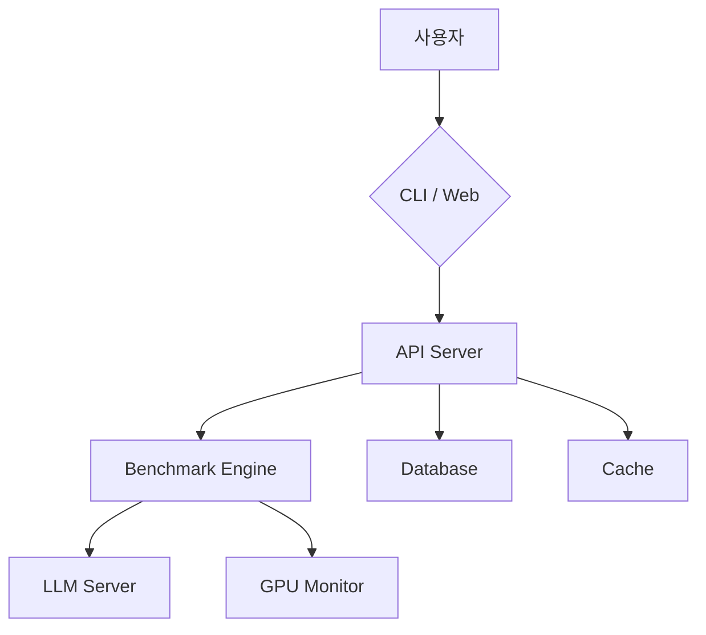

# PRD: LLM Loadtest 고도화

> **버전**: 2.0
> **작성일**: 2026-01-10
> **작성자**: PRD Writer Agent
> **상태**: Draft

---

## 1. 개요

### 1.1 목적
LLM 서빙 서버(vLLM, SGLang, Ollama 등)의 부하 테스트 도구를 안정화하고, 프로덕션 환경에서 사용 가능한 수준으로 고도화합니다.

### 1.2 배경
현재 프로젝트는 약 70% 완성 상태입니다. 핵심 기능(부하 테스트, 메트릭 측정, Web 대시보드)은 구현되어 있으나, 클라이언트 에러, 타입 안전성 부족, 프로덕션 준비도 미흡 등의 문제가 있습니다.

**현재 구현 상태**:
- Core: 벤치마크 엔진 (TTFT, TPOT, E2E, Throughput, Goodput 측정)
- Adapters: OpenAI Compatible (vLLM, SGLang, Ollama), Triton (미완성)
- CLI: `llm-loadtest` 명령어 (`run`, `info`, `gpu`)
- API: FastAPI REST 백엔드 (SQLite)
- Web: Next.js 대시보드

### 1.3 범위

**포함 (In Scope)**:
- Phase 1: 긴급 버그 수정 및 안정화
- Phase 2: 핵심 기능 개선 (토큰 카운팅, GPU 모니터링, 내보내기)
- Phase 3: 사용자 경험 개선 (차트, 비교, 프리셋)
- Phase 4: 프로덕션 준비 (인증, 로깅, 캐싱)

**제외 (Out of Scope)**:
- Triton/TensorRT-LLM 어댑터 완성 (별도 프로젝트)
- 분산 부하 테스트 (다중 클라이언트)
- Kubernetes Operator 개발
- SaaS 멀티테넌시

### 1.4 성공 지표

| 지표 | 현재 | 목표 | 측정 방법 |
|------|------|------|----------|
| 클라이언트 에러 | 5+ 건 | 0 건 | Web 콘솔 에러 |
| 토큰 카운팅 정확도 | ~60% | 95%+ | tiktoken 대비 |
| 테스트 커버리지 | 0% | 80%+ | pytest/jest |
| API 응답시간 (p95) | 미측정 | < 200ms | 모니터링 |

---

## 2. 사용자 스토리

### 2.1 사용자 페르소나

| 페르소나 | 설명 | 목표 | 페인포인트 |
|----------|------|------|-----------|
| ML Engineer | LLM 서빙 최적화 담당 | 서버 성능 측정 및 최적화 | 부하 테스트 도구 부재 |
| DevOps | 인프라 및 배포 담당 | SLO 기반 성능 모니터링 | 수동 테스트 반복 |
| 연구원 | 모델 성능 평가 | 다양한 모델 비교 | 결과 정리 어려움 |

### 2.2 유저 스토리 목록

#### 필수 (Must Have) - Phase 1

| ID | 역할 | 원하는 것 | 이유 | 수용기준 |
|----|------|----------|------|---------|
| US-001 | 사용자로서 | 벤치마크 결과 페이지가 에러 없이 로드되길 | 결과를 확인하기 위해 | Given 벤치마크 완료 시, When 결과 페이지 접속, Then 에러 없이 차트/테이블 표시 |
| US-002 | 사용자로서 | 비교 페이지에서 안전하게 결과를 비교하길 | 모델 성능 비교를 위해 | Given 2개 이상 완료된 벤치마크, When 비교 실행, Then 타입 에러 없이 비교 결과 표시 |
| US-003 | 사용자로서 | 에러 발생 시 명확한 메시지를 보길 | 문제 해결을 위해 | Given 에러 발생 시, When 에러 페이지 표시, Then 안전한 에러 메시지 표시 |

#### 필수 (Must Have) - Phase 2

| ID | 역할 | 원하는 것 | 이유 | 수용기준 |
|----|------|----------|------|---------|
| US-101 | ML Engineer로서 | 정확한 토큰 수 측정을 원함 | 정확한 처리량 계산을 위해 | Given tiktoken 사용, When 토큰 카운팅, Then 실제 토큰 수와 95% 이상 일치 |
| US-102 | DevOps로서 | GPU 사용량을 실시간 모니터링하길 | 리소스 최적화를 위해 | Given 벤치마크 실행 중, When GPU 탭 확인, Then 메모리/활용률/온도/전력 표시 |
| US-103 | 사용자로서 | 결과를 CSV/Excel로 내보내길 | 보고서 작성을 위해 | Given 완료된 벤치마크, When 내보내기 클릭, Then CSV/Excel 다운로드 |
| US-104 | 사용자로서 | 벤치마크 진행 상황을 실시간으로 보길 | 대기 시간 파악을 위해 | Given 벤치마크 실행 중, When 상태 페이지 확인, Then WebSocket으로 실시간 진행률 표시 |

#### 중요 (Should Have) - Phase 3

| ID | 역할 | 원하는 것 | 이유 | 수용기준 |
|----|------|----------|------|---------|
| US-201 | 사용자로서 | 더 직관적인 차트를 보길 | 결과 이해를 위해 | Given 결과 페이지, When 차트 확인, Then 줌/팬/툴팁 지원 |
| US-202 | 연구원으로서 | 다양한 조건으로 결과를 비교하길 | 심층 분석을 위해 | Given 비교 페이지, When 조건 선택, Then 모델/동시성별 비교 차트 표시 |
| US-203 | DevOps로서 | 자주 사용하는 설정을 저장하길 | 반복 작업 효율화를 위해 | Given 벤치마크 설정, When 프리셋 저장, Then 다음 실행에 로드 가능 |
| US-204 | 사용자로서 | 다크모드를 사용하길 | 눈 피로 감소를 위해 | Given 설정 페이지, When 테마 토글, Then 다크/라이트 모드 전환 |

#### 선택 (Could Have) - Phase 4

| ID | 역할 | 원하는 것 | 이유 | 수용기준 |
|----|------|----------|------|---------|
| US-301 | 관리자로서 | API 접근을 제어하길 | 보안을 위해 | Given API Key 설정, When 요청 시 키 포함, Then 인증 통과 |
| US-302 | DevOps로서 | 구조화된 로그를 보길 | 디버깅을 위해 | Given 서버 실행, When 로그 확인, Then JSON 형식 로그 출력 |
| US-303 | 사용자로서 | 빠른 결과 조회를 원함 | 반복 조회 효율화를 위해 | Given 결과 조회, When 동일 요청 반복, Then Redis 캐시에서 반환 |

---

## 3. 기능 요구사항

### 3.1 기능 개요



### 3.2 상세 기능 명세

---

## Phase 1: 버그 수정 및 안정화

**목표**: 클라이언트 에러 제거, 타입 안전성 확보
**예상 소요**: 2-3일
**영향도**: Critical

---

#### FR-001: refetchInterval 타입 에러 수정

- **파일**: `web/src/app/benchmark/[id]/page.tsx` (Line 26-27)
- **문제**: `data?.state?.data?.status` - 잘못된 데이터 접근 경로
- **설명**: React Query v5의 refetchInterval 콜백 시그니처 변경으로 인한 타입 에러
- **우선순위**: Must Have
- **수정 방법**:
```typescript
// 현재 (에러)
refetchInterval: (data) =>
  data?.state?.data?.status === "running" ? 2000 : false,

// 수정 (React Query v5)
refetchInterval: (query) =>
  query.state.data?.status === "running" ? 2000 : false,
```

---

#### FR-002: Compare 페이지 타입 안전성

- **파일**: `web/src/app/compare/page.tsx` (Line 94-108)
- **문제**: `as any` 타입 강제 변환으로 undefined 접근 에러
- **설명**: comparison.comparison 객체의 타입이 정의되지 않아 런타임 에러 발생
- **우선순위**: Must Have
- **수정 방법**:
```typescript
// 1. ComparisonResult 인터페이스 정의 (api.ts)
export interface ComparisonResult {
  run_count: number;
  best_throughput: {
    run_id: string;
    value: number;
    concurrency?: number;
  };
  best_ttft: {
    run_id: string;
    value: number;
    concurrency?: number;
  };
  by_concurrency: Record<string, unknown>;
}

// 2. compareRuns 반환 타입 수정
async compareRuns(runIds: string[]): Promise<{ comparison: ComparisonResult }> {
  // ...
}

// 3. 안전한 접근
{comparison?.comparison?.best_throughput?.value?.toFixed(1) ?? "N/A"}
```

---

#### FR-003: 에러 핸들링 개선

- **파일**: `web/src/app/benchmark/[id]/page.tsx` (Line 65)
- **문제**: `(error as Error).message` 타입 강제 변환 불안전
- **설명**: error가 Error 인스턴스가 아닐 경우 크래시
- **우선순위**: Must Have
- **수정 방법**:
```typescript
// 안전한 에러 메시지 추출 유틸리티 함수
function getErrorMessage(error: unknown): string {
  if (error instanceof Error) return error.message;
  if (typeof error === 'string') return error;
  return 'An unknown error occurred';
}

// 사용
<p className="text-red-600">
  {status?.status === "failed"
    ? "Benchmark failed"
    : getErrorMessage(error)}
</p>
```

---

#### FR-004: Goodput undefined 처리

- **파일**: `web/src/app/benchmark/[id]/page.tsx` (Line 91)
- **문제**: `r.goodput?.goodput_percent` undefined 시 Recharts 렌더링 에러
- **설명**: Recharts Line 컴포넌트에 undefined 값 전달 시 렌더링 실패
- **우선순위**: Must Have
- **수정 방법**:
```typescript
const chartData = result.results.map((r) => ({
  concurrency: r.concurrency,
  throughput: r.throughput_tokens_per_sec,
  ttft_p50: r.ttft.p50,
  ttft_p99: r.ttft.p99,
  error_rate: r.error_rate_percent,
  // undefined 대신 null 사용 (Recharts는 null을 건너뜀)
  goodput: r.goodput?.goodput_percent ?? null,
}));
```

---

#### FR-005: sys.path 조작 제거

- **파일**: `api/src/llm_loadtest_api/services/benchmark_service.py` (Line 11-12)
- **파일**: `cli/src/llm_loadtest/commands/run.py` (Line 11-13)
- **문제**: `sys.path.insert(0, ...)` 불안정한 import 구조
- **설명**: 상대 경로 조작은 배포/테스트 환경에서 문제 발생 가능
- **우선순위**: Should Have
- **수정 방법**:
```bash
# 프로젝트 구조 개선: 모노레포 방식으로 패키징
llm-loadtest/
├── pyproject.toml          # 루트 패키지 정의
├── src/
│   └── llm_loadtest/
│       ├── core/           # core 모듈
│       ├── adapters/       # adapters 모듈
│       ├── cli/            # CLI 진입점
│       └── api/            # API 진입점
```

```toml
# pyproject.toml
[project]
name = "llm-loadtest"
packages = [
    { include = "llm_loadtest", from = "src" }
]
```

---

#### FR-006: 예외 처리 구체화

- **파일**: `adapters/openai_compat.py` (Line 154, 218, 238, 246)
- **문제**: 너무 광범위한 `except Exception` 처리
- **설명**: 모든 예외를 동일하게 처리하면 디버깅이 어려움
- **우선순위**: Should Have
- **수정 방법**:
```python
except httpx.HTTPStatusError as e:
    # HTTP 에러 처리
    return RequestResult(
        error_type=f"HTTP_{e.response.status_code}",
        ...
    )
except httpx.TimeoutException as e:
    # 타임아웃 처리
    return RequestResult(
        error_type="TIMEOUT",
        ...
    )
except httpx.ConnectError as e:
    # 연결 에러 처리
    return RequestResult(
        error_type="CONNECTION_ERROR",
        ...
    )
except json.JSONDecodeError as e:
    # JSON 파싱 에러
    return RequestResult(
        error_type="JSON_PARSE_ERROR",
        ...
    )
except Exception as e:
    # 예상치 못한 에러 (로깅 필수)
    logger.exception("Unexpected error during request")
    return RequestResult(
        error_type=f"UNEXPECTED:{type(e).__name__}",
        ...
    )
```

---

## Phase 2: 핵심 기능 개선

**목표**: 정확한 메트릭, 실시간 모니터링, 데이터 내보내기
**예상 소요**: 5-7일
**영향도**: High

---

#### FR-101: 정확한 토큰 카운팅 (tiktoken)

- **파일**: `adapters/openai_compat.py` (Line 137, 149, 191)
- **문제**: `len(prompt.split())` word split 방식은 부정확
- **설명**: 실제 토큰 수와 크게 차이날 수 있음 (특히 한국어, 코드)
- **우선순위**: Must Have
- **입력**: 프롬프트 문자열, 모델명
- **출력**: 정확한 토큰 수
- **구현**:
```python
# core/tokenizer.py
from typing import Optional
import tiktoken

class TokenCounter:
    """Token counting utility using tiktoken."""

    _encoders: dict[str, tiktoken.Encoding] = {}

    @classmethod
    def get_encoder(cls, model: str) -> tiktoken.Encoding:
        """Get or create tiktoken encoder for model."""
        if model not in cls._encoders:
            try:
                # OpenAI 모델 이름으로 시도
                cls._encoders[model] = tiktoken.encoding_for_model(model)
            except KeyError:
                # 기본 인코더 사용 (cl100k_base = GPT-4/3.5)
                cls._encoders[model] = tiktoken.get_encoding("cl100k_base")
        return cls._encoders[model]

    @classmethod
    def count(cls, text: str, model: str = "gpt-4") -> int:
        """Count tokens in text."""
        encoder = cls.get_encoder(model)
        return len(encoder.encode(text))

    @classmethod
    def count_approximate(cls, text: str) -> int:
        """Fallback: approximate token count (1 token ~ 4 chars)."""
        return len(text) // 4

# 사용
input_tokens = TokenCounter.count(prompt, self.model)
```

- **의존성 추가**: `tiktoken>=0.5.0`

---

#### FR-102: GPU 모니터링 실제 구현

- **파일**: `core/models.py` (GPUMetrics 모델은 존재)
- **파일**: `cli/src/llm_loadtest/commands/gpu.py` (CLI만 구현됨)
- **문제**: 벤치마크 실행 중 GPU 메트릭 수집 미구현
- **설명**: GPUMetrics 모델은 있지만 실제 수집 로직 없음
- **우선순위**: Must Have
- **구현**:
```python
# core/gpu_monitor.py
import asyncio
import threading
from typing import Optional
from dataclasses import dataclass
from core.models import GPUMetrics

@dataclass
class GPUSample:
    timestamp: float
    memory_used_gb: float
    memory_total_gb: float
    gpu_util_percent: float
    temperature_celsius: Optional[float]
    power_draw_watts: Optional[float]

class GPUMonitor:
    """Background GPU metrics collector."""

    def __init__(self, sample_interval: float = 1.0):
        self.sample_interval = sample_interval
        self.samples: list[GPUSample] = []
        self._stop_event = threading.Event()
        self._thread: Optional[threading.Thread] = None

    def start(self) -> None:
        """Start background monitoring."""
        self._stop_event.clear()
        self._thread = threading.Thread(target=self._collect_loop, daemon=True)
        self._thread.start()

    def stop(self) -> GPUMetrics:
        """Stop monitoring and return aggregated metrics."""
        self._stop_event.set()
        if self._thread:
            self._thread.join(timeout=2.0)
        return self._aggregate()

    def _collect_loop(self) -> None:
        """Collection loop running in background thread."""
        try:
            import pynvml
            pynvml.nvmlInit()
            handle = pynvml.nvmlDeviceGetHandleByIndex(0)

            while not self._stop_event.is_set():
                sample = self._collect_sample(handle)
                self.samples.append(sample)
                self._stop_event.wait(self.sample_interval)

            pynvml.nvmlShutdown()
        except Exception:
            pass  # GPU 모니터링 실패 시 무시

    def _collect_sample(self, handle) -> GPUSample:
        import pynvml
        import time

        mem = pynvml.nvmlDeviceGetMemoryInfo(handle)
        try:
            util = pynvml.nvmlDeviceGetUtilizationRates(handle)
            gpu_util = util.gpu
        except Exception:
            gpu_util = 0

        try:
            temp = pynvml.nvmlDeviceGetTemperature(handle, pynvml.NVML_TEMPERATURE_GPU)
        except Exception:
            temp = None

        try:
            power = pynvml.nvmlDeviceGetPowerUsage(handle) / 1000
        except Exception:
            power = None

        return GPUSample(
            timestamp=time.time(),
            memory_used_gb=mem.used / (1024**3),
            memory_total_gb=mem.total / (1024**3),
            gpu_util_percent=gpu_util,
            temperature_celsius=temp,
            power_draw_watts=power,
        )

    def _aggregate(self) -> GPUMetrics:
        """Aggregate samples into final metrics."""
        if not self.samples:
            return GPUMetrics(
                device_name="Unknown",
                gpu_index=0,
                memory_used_gb=0,
                memory_total_gb=0,
                memory_util_percent=0,
                gpu_util_percent=0,
            )

        # Peak/Average 계산
        avg_mem_used = sum(s.memory_used_gb for s in self.samples) / len(self.samples)
        peak_mem_used = max(s.memory_used_gb for s in self.samples)
        avg_gpu_util = sum(s.gpu_util_percent for s in self.samples) / len(self.samples)

        last = self.samples[-1]
        return GPUMetrics(
            device_name="NVIDIA GPU",  # TODO: 실제 이름 가져오기
            gpu_index=0,
            memory_used_gb=peak_mem_used,
            memory_total_gb=last.memory_total_gb,
            memory_util_percent=peak_mem_used / last.memory_total_gb * 100,
            gpu_util_percent=avg_gpu_util,
            temperature_celsius=last.temperature_celsius,
            power_draw_watts=last.power_draw_watts,
        )
```

---

#### FR-103: 결과 내보내기 (CSV, Excel)

- **설명**: 벤치마크 결과를 CSV/Excel 형식으로 다운로드
- **우선순위**: Must Have
- **API 엔드포인트**:
```python
# api/src/llm_loadtest_api/routers/benchmarks.py

@router.get("/result/{run_id}/export")
async def export_result(
    run_id: str,
    format: Literal["csv", "xlsx"] = "csv",
) -> Response:
    """Export benchmark result to CSV or Excel."""
    result = service.get_result(run_id)
    if not result:
        raise HTTPException(404, "Result not found")

    if format == "csv":
        csv_content = export_to_csv(result)
        return Response(
            content=csv_content,
            media_type="text/csv",
            headers={"Content-Disposition": f"attachment; filename={run_id}.csv"}
        )
    else:
        xlsx_content = export_to_xlsx(result)
        return Response(
            content=xlsx_content,
            media_type="application/vnd.openxmlformats-officedocument.spreadsheetml.sheet",
            headers={"Content-Disposition": f"attachment; filename={run_id}.xlsx"}
        )

def export_to_csv(result: dict) -> str:
    """Convert result to CSV format."""
    import io
    import csv

    output = io.StringIO()
    writer = csv.writer(output)

    # 헤더
    writer.writerow([
        "Concurrency", "Throughput (tok/s)", "TTFT p50 (ms)", "TTFT p99 (ms)",
        "TPOT p50 (ms)", "TPOT p99 (ms)", "E2E p50 (ms)", "E2E p99 (ms)",
        "Requests", "Success", "Error Rate (%)", "Goodput (%)"
    ])

    # 데이터
    for r in result.get("results", []):
        writer.writerow([
            r["concurrency"],
            f"{r['throughput_tokens_per_sec']:.1f}",
            f"{r['ttft']['p50']:.1f}",
            f"{r['ttft']['p99']:.1f}",
            f"{r.get('tpot', {}).get('p50', 0):.1f}",
            f"{r.get('tpot', {}).get('p99', 0):.1f}",
            f"{r['e2e_latency']['p50']:.1f}",
            f"{r['e2e_latency']['p99']:.1f}",
            r["total_requests"],
            r["successful_requests"],
            f"{r['error_rate_percent']:.2f}",
            f"{r.get('goodput', {}).get('goodput_percent', 0):.1f}" if r.get('goodput') else "",
        ])

    return output.getvalue()
```

- **의존성 추가**: `openpyxl>=3.1.0` (Excel 지원)

---

#### FR-104: 실시간 진행 상황 (WebSocket)

- **설명**: 벤치마크 실행 중 실시간 진행률 표시
- **우선순위**: Should Have
- **구현**:
```python
# api/src/llm_loadtest_api/routers/websocket.py
from fastapi import WebSocket, WebSocketDisconnect
from typing import Dict, Set

class ConnectionManager:
    def __init__(self):
        self.active_connections: Dict[str, Set[WebSocket]] = {}

    async def connect(self, run_id: str, websocket: WebSocket):
        await websocket.accept()
        if run_id not in self.active_connections:
            self.active_connections[run_id] = set()
        self.active_connections[run_id].add(websocket)

    async def broadcast(self, run_id: str, message: dict):
        if run_id in self.active_connections:
            for ws in self.active_connections[run_id]:
                await ws.send_json(message)

manager = ConnectionManager()

@router.websocket("/ws/run/{run_id}")
async def websocket_endpoint(websocket: WebSocket, run_id: str):
    await manager.connect(run_id, websocket)
    try:
        while True:
            await websocket.receive_text()
    except WebSocketDisconnect:
        manager.active_connections[run_id].discard(websocket)
```

**Frontend 연동**:
```typescript
// web/src/hooks/useBenchmarkProgress.ts
export function useBenchmarkProgress(runId: string) {
  const [progress, setProgress] = useState<Progress | null>(null);

  useEffect(() => {
    const ws = new WebSocket(`ws://localhost:8085/api/v1/benchmark/ws/run/${runId}`);

    ws.onmessage = (event) => {
      const data = JSON.parse(event.data);
      setProgress(data);
    };

    return () => ws.close();
  }, [runId]);

  return progress;
}
```

---

## Phase 3: 사용자 경험 개선

**목표**: 더 나은 시각화, 편의 기능
**예상 소요**: 4-5일
**영향도**: Medium

---

#### FR-201: 대시보드 차트 개선

- **설명**: 인터랙티브 차트 (줌, 팬, 툴팁 개선)
- **우선순위**: Should Have
- **구현**: Recharts 고급 기능 활용
```typescript
// 줌 가능한 차트
<ResponsiveContainer>
  <LineChart data={chartData}>
    <Brush dataKey="concurrency" height={30} stroke="#8884d8" />
    <Tooltip
      content={<CustomTooltip />}
      formatter={(value, name) => [value?.toFixed(2), name]}
    />
    // ...
  </LineChart>
</ResponsiveContainer>

// 멀티 Y축 (Throughput + Latency 동시 표시)
<YAxis yAxisId="left" orientation="left" stroke="#8884d8" />
<YAxis yAxisId="right" orientation="right" stroke="#82ca9d" />
<Line yAxisId="left" dataKey="throughput" />
<Line yAxisId="right" dataKey="ttft_p50" />
```

---

#### FR-202: 결과 비교 기능 강화

- **설명**: 동시성별, 모델별 비교 차트
- **우선순위**: Should Have
- **구현**:
```typescript
// 비교 차트 컴포넌트
interface CompareChartProps {
  runs: BenchmarkResult[];
  metric: 'throughput' | 'ttft' | 'tpot' | 'goodput';
}

function CompareChart({ runs, metric }: CompareChartProps) {
  // 동일 동시성 레벨에서 각 런의 메트릭 비교
  const data = extractComparisonData(runs, metric);

  return (
    <BarChart data={data}>
      {runs.map((run, idx) => (
        <Bar
          key={run.run_id}
          dataKey={`run_${idx}`}
          name={`${run.model} (${new Date(run.started_at).toLocaleDateString()})`}
          fill={COLORS[idx]}
        />
      ))}
    </BarChart>
  );
}
```

---

#### FR-203: 테스트 프리셋 기능

- **설명**: 자주 사용하는 벤치마크 설정을 저장/로드
- **우선순위**: Could Have
- **DB 스키마**:
```sql
CREATE TABLE presets (
    id TEXT PRIMARY KEY,
    name TEXT NOT NULL,
    config JSON NOT NULL,
    created_at DATETIME DEFAULT CURRENT_TIMESTAMP
);
```
- **API**:
```python
@router.get("/presets")
async def list_presets(): ...

@router.post("/presets")
async def create_preset(name: str, config: BenchmarkRequest): ...

@router.get("/presets/{preset_id}")
async def get_preset(preset_id: str): ...

@router.delete("/presets/{preset_id}")
async def delete_preset(preset_id: str): ...
```

---

#### FR-204: 다크모드/라이트모드 토글

- **설명**: 시스템 설정 감지 + 수동 토글
- **우선순위**: Could Have
- **구현**:
```typescript
// providers.tsx
'use client';

import { ThemeProvider } from 'next-themes';

export function Providers({ children }: { children: React.ReactNode }) {
  return (
    <ThemeProvider attribute="class" defaultTheme="system">
      <QueryClientProvider client={queryClient}>
        {children}
      </QueryClientProvider>
    </ThemeProvider>
  );
}

// 토글 컴포넌트
function ThemeToggle() {
  const { theme, setTheme } = useTheme();

  return (
    <button onClick={() => setTheme(theme === 'dark' ? 'light' : 'dark')}>
      {theme === 'dark' ? <Sun /> : <Moon />}
    </button>
  );
}
```

---

## Phase 4: 프로덕션 준비

**목표**: 보안, 모니터링, 성능 최적화
**예상 소요**: 5-7일
**영향도**: High (프로덕션 필수)

---

#### FR-301: API 인증 (API Key)

- **설명**: Bearer 토큰 기반 API 인증
- **우선순위**: Must Have (프로덕션)
- **구현**:
```python
# api/src/llm_loadtest_api/auth.py
from fastapi import Depends, HTTPException, Security
from fastapi.security import APIKeyHeader
import os

API_KEY_HEADER = APIKeyHeader(name="X-API-Key", auto_error=False)

def get_api_key(api_key: str = Security(API_KEY_HEADER)) -> str:
    expected = os.getenv("LLM_LOADTEST_API_KEY")
    if not expected:
        return ""  # 인증 비활성화

    if api_key != expected:
        raise HTTPException(401, "Invalid API Key")

    return api_key

# 라우터에 적용
@router.post("/run", dependencies=[Depends(get_api_key)])
async def start_run(request: BenchmarkRequest): ...
```

---

#### FR-302: 구조화된 로깅

- **설명**: JSON 형식 로그, 로그 레벨 설정
- **우선순위**: Should Have
- **구현**:
```python
# api/src/llm_loadtest_api/logging.py
import structlog
import logging

def configure_logging(level: str = "INFO"):
    structlog.configure(
        processors=[
            structlog.contextvars.merge_contextvars,
            structlog.processors.add_log_level,
            structlog.processors.TimeStamper(fmt="iso"),
            structlog.processors.JSONRenderer()
        ],
        wrapper_class=structlog.make_filtering_bound_logger(
            getattr(logging, level)
        ),
        context_class=dict,
        cache_logger_on_first_use=True,
    )

# 사용
logger = structlog.get_logger()
logger.info("benchmark_started", run_id=run_id, model=config.model)
```

---

#### FR-303: 결과 캐싱 (Redis)

- **설명**: 완료된 벤치마크 결과 Redis 캐싱
- **우선순위**: Could Have
- **구현**:
```python
# api/src/llm_loadtest_api/cache.py
import redis.asyncio as redis
import json
from typing import Optional

class ResultCache:
    def __init__(self, redis_url: str = "redis://localhost:6379"):
        self.redis = redis.from_url(redis_url)
        self.ttl = 3600 * 24  # 24시간

    async def get(self, run_id: str) -> Optional[dict]:
        data = await self.redis.get(f"result:{run_id}")
        if data:
            return json.loads(data)
        return None

    async def set(self, run_id: str, result: dict) -> None:
        await self.redis.setex(
            f"result:{run_id}",
            self.ttl,
            json.dumps(result)
        )

    async def invalidate(self, run_id: str) -> None:
        await self.redis.delete(f"result:{run_id}")
```

---

#### FR-304: 성능 최적화

- **설명**: API 응답시간 최적화
- **우선순위**: Should Have
- **최적화 항목**:

| 항목 | 현재 | 목표 | 방법 |
|------|------|------|------|
| 결과 조회 | ~500ms | <100ms | 인덱스 + 캐싱 |
| 히스토리 목록 | ~300ms | <100ms | 페이지네이션 최적화 |
| 비교 API | ~1s | <300ms | 병렬 조회 |

**DB 인덱스**:
```sql
CREATE INDEX idx_runs_status ON runs(status);
CREATE INDEX idx_runs_created_at ON runs(created_at DESC);
CREATE INDEX idx_runs_model ON runs(model);
```

---

## 4. 비기능 요구사항

### 4.1 성능

| 항목 | 요구사항 | 측정 기준 |
|------|---------|----------|
| API 응답 시간 | < 200ms | p95 |
| WebSocket 지연 | < 100ms | 평균 |
| 동시 벤치마크 | 5개 | 부하 테스트 |
| DB 쿼리 | < 50ms | slow query log |

### 4.2 보안

- [ ] API Key 인증 (Phase 4)
- [ ] HTTPS 지원 (nginx 프록시)
- [ ] 입력 유효성 검사 (Pydantic)
- [ ] Rate Limiting (Phase 4)
- [ ] 민감 정보 마스킹 (API Key 로깅 제외)

### 4.3 호환성

| 플랫폼 | 최소 버전 |
|--------|----------|
| Python | 3.11+ |
| Node.js | 20+ |
| Chrome | 90+ |
| Docker | 20.10+ |

---

## 5. 의존성 및 제약사항

### 5.1 기술적 의존성

| 패키지 | 용도 | Phase |
|--------|------|-------|
| tiktoken | 토큰 카운팅 | Phase 2 |
| pynvml (nvidia-ml-py) | GPU 모니터링 | Phase 2 |
| openpyxl | Excel 내보내기 | Phase 2 |
| structlog | 구조화 로깅 | Phase 4 |
| redis | 결과 캐싱 | Phase 4 |
| next-themes | 다크모드 | Phase 3 |

### 5.2 제약사항

- GPU 모니터링은 NVIDIA GPU에서만 작동 (pynvml)
- tiktoken은 OpenAI 토크나이저 기반, 다른 모델은 근사치
- Redis 캐싱은 선택적 (없으면 DB 직접 조회)

---

## 6. 릴리스 계획

### 6.1 마일스톤

| 마일스톤 | 예상 완료일 | 산출물 |
|----------|-------------|--------|
| Phase 1 완료 | D+3 | 버그 수정, 안정화 |
| Phase 2 완료 | D+10 | 핵심 기능 개선 |
| Phase 3 완료 | D+15 | UX 개선 |
| Phase 4 완료 | D+22 | 프로덕션 준비 |

### 6.2 단계적 롤아웃

1. **v2.0-alpha**: Phase 1 완료 (내부 테스트)
2. **v2.0-beta**: Phase 2 완료 (제한된 사용자)
3. **v2.0-rc**: Phase 3 완료 (광범위 테스트)
4. **v2.0**: Phase 4 완료 (정식 릴리스)

---

## 7. 부록

### A. 파일별 수정 사항 요약

| 파일 | Phase | 수정 내용 |
|------|-------|----------|
| `web/src/app/benchmark/[id]/page.tsx` | 1 | refetchInterval, error handling, goodput null |
| `web/src/app/compare/page.tsx` | 1 | 타입 안전성 개선 |
| `web/src/lib/api.ts` | 1 | ComparisonResult 타입 정의 |
| `adapters/openai_compat.py` | 1, 2 | 예외 처리, tiktoken 적용 |
| `core/tokenizer.py` | 2 | 신규 - tiktoken 래퍼 |
| `core/gpu_monitor.py` | 2 | 신규 - GPU 모니터링 |
| `api/.../routers/benchmarks.py` | 2 | 내보내기 API |
| `api/.../routers/websocket.py` | 2 | 신규 - WebSocket |
| `web/src/hooks/useBenchmarkProgress.ts` | 2 | 신규 - WebSocket 훅 |
| `web/src/app/providers.tsx` | 3 | 테마 프로바이더 |
| `api/.../auth.py` | 4 | 신규 - API 인증 |
| `api/.../cache.py` | 4 | 신규 - Redis 캐시 |
| `api/.../logging.py` | 4 | 신규 - 구조화 로깅 |

### B. 변경 이력

| 버전 | 날짜 | 변경 내용 | 작성자 |
|------|------|----------|--------|
| 2.0 | 2026-01-10 | 고도화 PRD 초안 | PRD Writer Agent |
